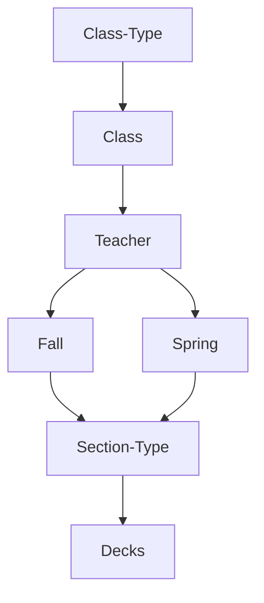

# Downloading
To download the decks, go to `Code -> Download Zip` and unzip the zip file

# Installing
In anki, go to the top bar, then `File -> Import` and select the deck you want from the downloaded class collection

# Orginization

Check out some decks and classes for reference if you are confused.
